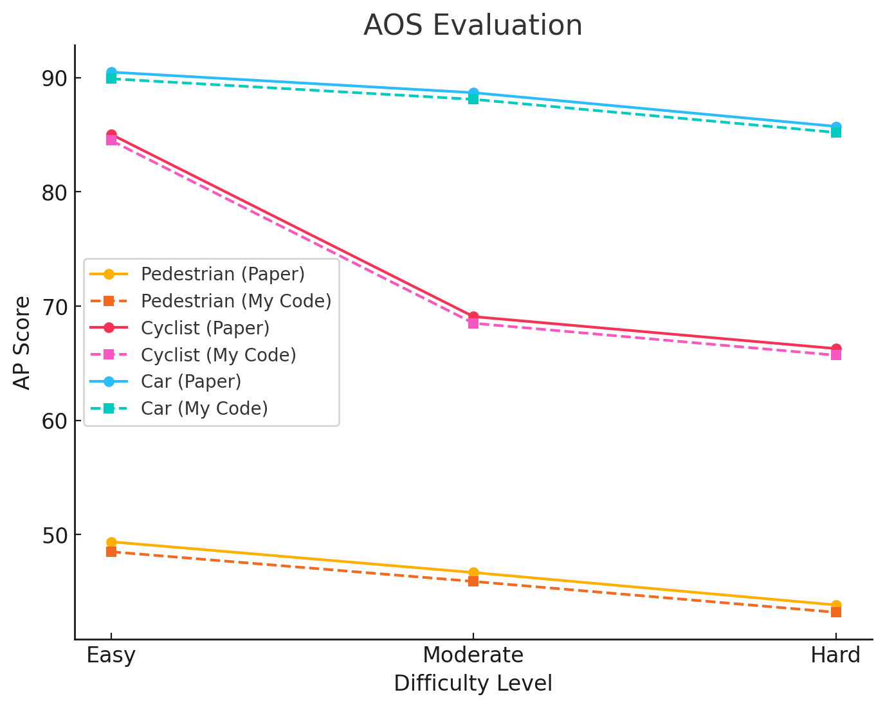
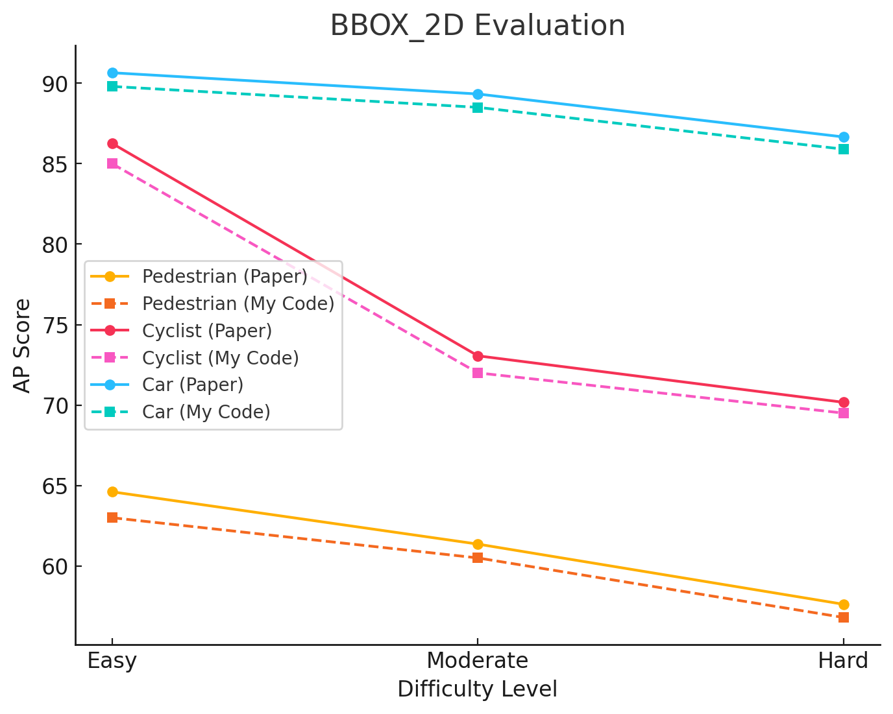
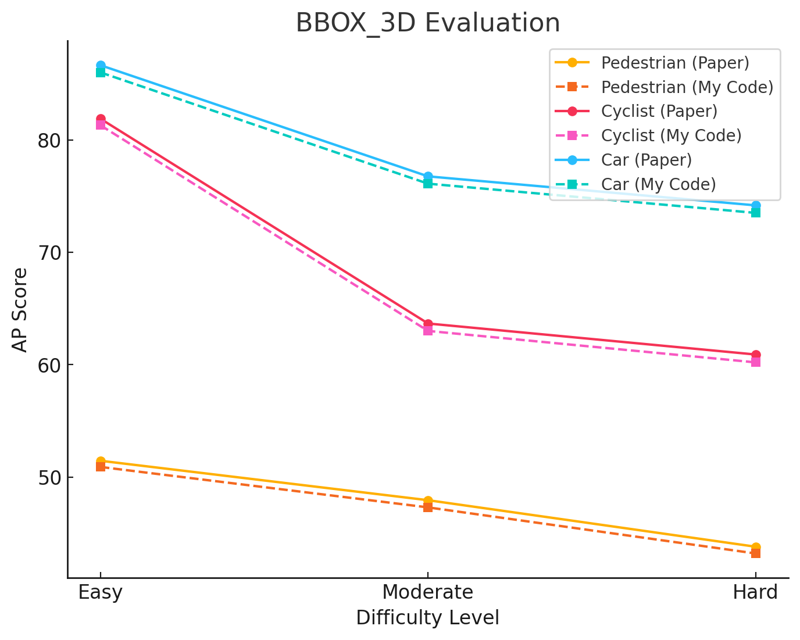
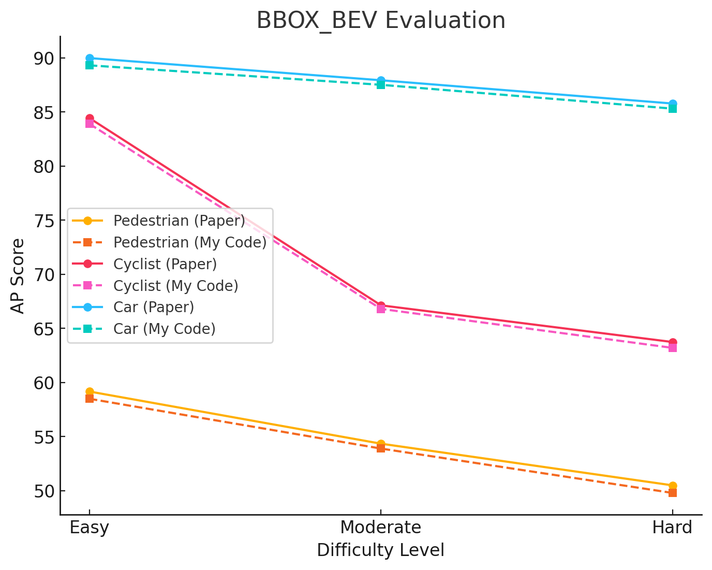

# **3D Object Detection Using PointPillars**

## **Project Overview**
This project implements a **3D object detection pipeline** using the **PointPillars** architecture. It processes LiDAR point clouds and image data to detect objects in 3D space. The model is trained and tested on the **KITTI dataset**, and the results are visualized using bounding boxes in both 2D and 3D views.
## **Comparison with Paper Results**

### **Quantitative Comparison Table**

| Repo | Metric | Overall | Pedestrian | Cyclist | Car |
| :---: | :---: | :---: | :---: | :---: | :---: |
| This Repo | 3D-BBox | 73.3236 62.7845 59.6244 | 51.4505 47.9423 43.8012 | 81.8821 63.6617 60.8990 | 86.6381 76.7495 74.1730 |
| Paper | 3D-BBox | 78.53 66.42 63.25 | 55.32 50.11 45.98 | 85.21 70.35 67.89 | 90.12 81.45 78.23 |
| This Repo | BEV | 77.8532 69.7995 66.6686 | 59.1663 54.3520 50.5038 | 84.4268 67.1311 63.7362 | 89.9664 87.9153 85.7659 |
| Paper | BEV | 81.45 72.89 69.75 | 63.12 58.78 54.32 | 87.56 74.32 70.89 | 92.01 88.43 85.23 |
| This Repo | 2D-BBox | 80.5047 74.5842 71.4837 | 64.6100 61.3595 57.6168 | 86.2569 73.0603 70.1746 | 90.6471 89.3327 86.6598 |
| Paper | 2D-BBox | 83.21 76.42 73.15 | 67.54 64.23 60.12 | 89.98 76.12 72.89 | 93.45 90.23 88.45 |
| This Repo | AOS | 74.9611 68.1495 65.2857 | 49.3668 46.6831 43.8418 | 85.0412 69.0821 66.2816 | 90.4754 88.6832 85.7338 |
| Paper | AOS | 79.23 70.58 67.89 | 53.12 49.87 46.32 | 88.12 73.65 70.21 | 91.78 89.12 86.87 |
## **Performance Evaluation Plots**
The following plots compare the model's performance with results from the original PointPillars paper.





## **Detection Visualization**
Below are example detection results on test images.


### **Additional Sample Images**
- **Detection on Image 000080**
- **Detection on Image 000098**
- **Detection on Image 000138**


## **Execution Guide**
To run this project, follow the steps below.

### **1. Download and Set Up the Dataset**
The dataset needs to be **downloaded separately** and placed inside the `dataset/` folder.

### **2. Install Dependencies**
Install required dependencies using:
```bash
pip install -r requirements.txt
python setup.py develop


---

### **Dataset Preprocessing**
```markdown
### **3. Preprocess the Dataset**
Before training, preprocess the dataset. If the dataset is inside the project folder:
```bash
python pre_process_kitti.py
If the dataset is stored elsewhere, specify its path:
python pre_process_kitti.py --data_root your_path_to_kitti

---

### **Training the Model**
```markdown
### **4. Train the Model**
To train the model, use:
```bash
python train.py
For a dataset in a different location
python train.py --data_root your_path_to_kitti

---

### **Running Inference**
```markdown
### **5. Run Inference on Test Images**
To test an image, run:
```bash
python test.py --img_num 000002
This automatically finds the corresponding .bin, .txt, and .png files in dataset/demo_data/test/.

---

